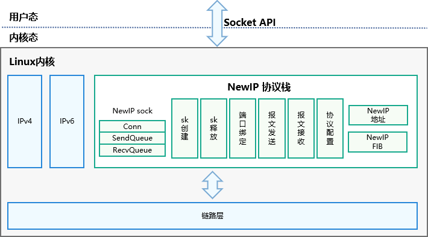

# New IP内核协议栈

## 简介

New IP在现有[IPv4/IPv6](https://git.kernel.org/pub/scm/linux/kernel/git/stable/linux.git/log/?h=linux-5.10.y)能力的基础上，以灵活轻量级报头和可变长多语义地址为基础，通过二三层协议融合，对协议去冗和压缩，减少冗余字节，实现高能效比，高净吞吐，提升通信效率。打造终端之间高效的横向通信，支撑超级终端的体验，实现异构网络的端到端互联。

目前WiFi协议报文，三层报头和地址开销使得报文开销大，传输效率较低。


```
IPv4地址长度固定4字节，IPv6地址长度固定16字节。
IPv4网络层报头长度20~60字节，IPv6网络层报头长度40字节。
```

New IP支持**可变长多语义地址（最短1字节）**，**可变长定制化报头封装（最短5字节）**，通过精简报文头开销，提升数据传输效率。

New IP报头开销，相比IPv4节省25.9%，相比IPv6节省44.9%。

New IP载荷传输效率，相比IPv4提高最少1%，相比IPv6提高最少2.33%。

| 对比场景        | 报头开销     | 载荷传输效率（WiFi MTU=1500B，BT MTU=255B） |
| --------------- | ------------ | ------------------------------------------- |
| IPv4 for WiFi   | 30+8+20=58 B | (1500-58)/1500=96.13%                       |
| IPv6 for WiFi   | 30+8+40=78 B | (1500-78)/1500=94.8%                        |
| New IP for WiFi | 30+8+5=43 B  | (1500-43)/1500=97.13%                       |

## 系统架构

New IP内核协议栈架构图如下，用户态应用程序调用Socket API创建New IP socket，采用New IP极简帧头封装进行收发包。



## 目录

New IP内核协议栈主要代码目录结构如下：

```
# 代码路径 /kernel/linux/common_modules/newip
├── examples              # New IP 用户态样例代码
├── src                   # New IP 自研代码
│   ├── common            # New IP 通用代码
│   └── linux-5.10        # New IP Linux-5.10内核代码
│       ├── net
│       │   └── newip     # New IP 功能代码
│       └── drivers
│           └── net
│               └── bt    # New IP 功能代码
├── third_party           # New IP 三方引用+增量开发代码
│   └── linux-5.10        # New IP Linux-5.10内核代码
│       ├── include       # New IP 头文件
│       │   ├── linux
│       │   ├── net
│       │   └── uapi
│       └── net
│           └── newip     # New IP 功能代码
├── figures               # ReadMe 内嵌图例
└── tools                 # New IP 配套工具
```

## 编译构建

详见“New IP内核协议栈开发手册-[配置指导](https://gitee.com/openharmony/docs/blob/master/zh-cn/device-dev/kernel/kernel-standard-newip.md#newip配置指导)”章节。

## 说明

### 可变长报头格式

详见“New IP内核协议栈开发手册-[可变报头格式](https://gitee.com/openharmony/docs/blob/master/zh-cn/device-dev/kernel/kernel-standard-newip.md#可变长报头格式)”章节。

### 可变长地址格式

详见“New IP内核协议栈开发手册-[可变长地址格式](https://gitee.com/openharmony/docs/blob/master/zh-cn/device-dev/kernel/kernel-standard-newip.md#可变长地址格式)”章节。

### 接口说明

详见“New IP内核协议栈开发手册-[New IP相关接口](https://gitee.com/openharmony/docs/blob/master/zh-cn/device-dev/kernel/kernel-standard-newip.md#newip相关接口)”章节。

### New IP收发包代码示例

详见“New IP内核协议栈开发手册-[New IP收发包代码示例](https://gitee.com/openharmony/docs/blob/master/zh-cn/device-dev/kernel/kernel-standard-newip.md#newip收发包代码示例)”章节。

### selinux规则说明

详见“New IP内核协议栈开发手册-[selinux规则说明](https://gitee.com/openharmony/docs/blob/master/zh-cn/device-dev/kernel/kernel-standard-newip.md#selinux规则说明)”章节。

## 相关仓

[内核子系统](https://gitee.com/openharmony/docs/blob/master/zh-cn/readme/%E5%86%85%E6%A0%B8%E5%AD%90%E7%B3%BB%E7%BB%9F.md)

[kernel_linux_5.10](https://gitee.com/openharmony/kernel_linux_5.10)

[kernel_linux_config](https://gitee.com/openharmony/kernel_linux_config)

[kernel_linux_build](https://gitee.com/openharmony/kernel_linux_build)

[device_board_hihope](https://gitee.com/openharmony/device_board_hihope)
