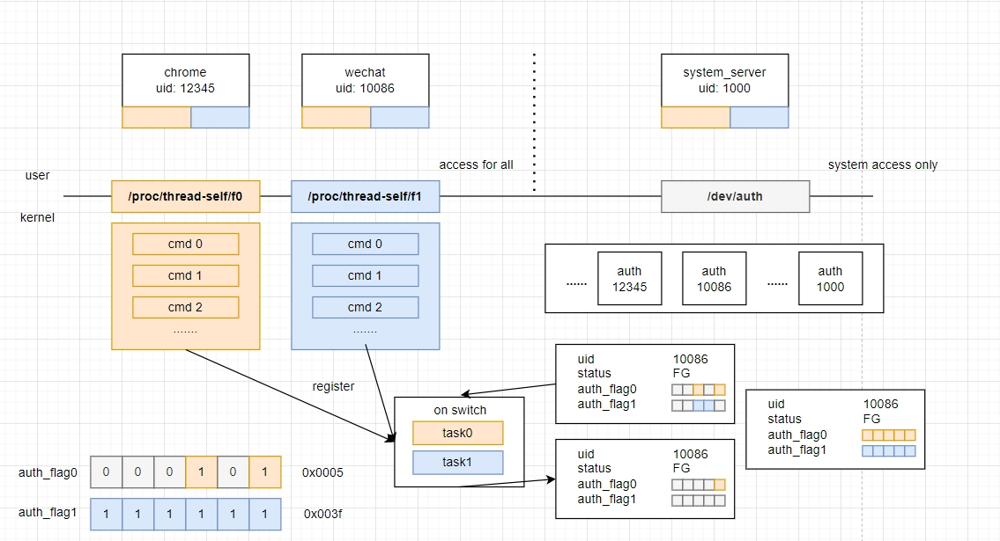
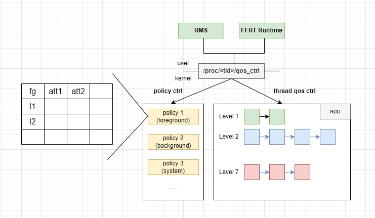

## 背景

为支持并发编程框架FFRT的底层调度能力而设计，允许app侧根据业务逻辑在线程间分配调度资源，保障关键任务时延达标，保障用户体验。

涉及到权限下放和调度资源分配，需要内核实现：

1. 高效的能感知状态的app权限管控机制(轻量化权限管控)
2. 动态的调度资源分配机制(动态多级qos)

## auth_ctrl(Authority Control)模块

轻量化权限管控模块，uid粒度的权限管控，根据app前后台状态动态管控对内核feature接口的访问权限



## qos_ctrl(Qos Control)模块

动态多级qos模块，提供多种policy（前台/后台/system等），每个policy包含6个qos等级，可以从时间片、调度时延、供给3个维度去更改线程调度行为



## 目录

```
├── README_zh.md
├── apply_qos_auth.sh
├── figures                      # ReadMe 内嵌图例
├── auth_ctl
│   ├── Kconfig
│   ├── Makefile
│   ├── auth_ctrl.c              #权限管控主体代码
│   ├── auth_ctrl.h
│   ├── auth_qos_debug.c         #debug节点主体
│   ├── qos_ctrl.c               #多级qos主体代码
│   └── qos_ctrl.h
└── include
    ├── auth_ctrl.h
    ├── qos_auth.h
    ├── qos_ctrl.h
    └── rtg_auth.h
```

## QOS_AUTH配置指导

1. 权限管控使能`CONFIG_AUTHORITY_CTRL=y`
2. 多级qos使能`CONFIG_QOS_CTRL=y`
3. RTG鉴权使能`CONFIG_RTG_AUTHORITY=y`
4. qos鉴权使能`CONFIG_QOS_AUTHORITY=y`
5. Debug节点使能`CONFIG_AUTH_QOS_DEBUG=y`
6. Qos策略数量限制`CONFIG_QOS_POLICY_MAX_NR=5`，范围[5, 20]

qos成功设置的宏依赖:

```
# 时延控制
CONFIG_SCHED_LATENCY_NICE=y

# 供给
CONFIG_UCLAMP_TASK=y
CONFIG_UCLAMP_BUCKETS_COUNT=20
CONFIG_UCLAMP_TASK_GROUP=y
```

## 相关仓


[kernel_linux_5.10](https://gitee.com/openharmony/kernel_linux_5.10)

[kernel_linux_config](https://gitee.com/openharmony/kernel_linux_config)

[device_board_hihope](https://gitee.com/openharmony/device_board_hihope)https://gitee.com/openharmony/device_board_hihope)