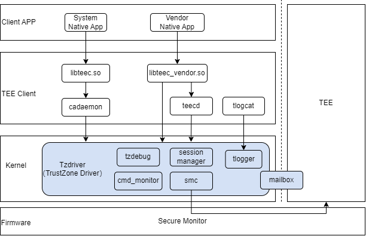

# Tzdriver driver

## Introduction

Tzdriver is a kernel driver deployed on the REE side, supporting communication between REE and TEE. Tzdriver processes commands from Tee Client and sends instructions to switch from REE to TEE. Tzdriver supports data sharing between REE and TEE by managing shared memory.

Tzdriver includes the following main modules:

smc: Send smc instructions to switch the CPU from the REE side to the TEE side for operation.

session_manager: Manage communication sessions between REE and TEE.

mailbox：Data is shared between REE and TEE through the mailbox.

cmd_monitor：Monitor the operation of SMC instructions and provides a timeout detection mechanism.

tzdebug：Create debugfs debugging nodes to facilitate developers in debugging TEE functionality

tlogger：TEE log driver module, supporting TEE log recording and printing.

Figure 1: Tzdriver architecture diagram



## Directory

```
/kernel/linux/common_modules/tzdriver
├── core
│   ├── cmdmonitor.c                # SMC instruction execution monitoring
    ├── gp_ops.c                    # GP TEE specification processing logic
    ├── mailbox_mempool.c           # REE and TEE shared memory management
    ├── session_manager.c           # Session management for CA access to TA
    ├── smc_smp.c                   # Send SMC command to switch to TEE
    ├── tzdebug.c                   # Debugging module
├── tlogger                         # TEE log driver
```

## Configuration Option

If you want to enable the Tzdriver driver, you need to modify the defconfig file of the device in the Linux kernel code repository and add configuration options for Tzdriver:

```
#
# TEEOS
#
CONFIG_TZDRIVER=y
CONFIG_CPU_AFF_NR=1
CONFIG_KERNEL_CLIENT=y
CONFIG_TEELOG=y
CONFIG_PAGES_MEM=y
CONFIG_THIRDPARTY_COMPATIBLE=y
```

The meanings of each option are shown in the table below:

**Table 1** Configuration Options Description

| Parameters                        | Description                                                       |
| ---------------------------- | ------------------------------------------------------------ |
| CONFIG_TZDRIVER              | Tzdriver module switch.                                            |
| CONFIG_CPU_AFF_NR            | CA binding core function, non-zero values represent restrictions on CPUID less than CONFIG_ CPU_ AFF_ NR's CPU can enter TEE, where 0 represents unlimited. Currently, Tzdriver only supports running on 0 cores, so the value is 1. |
| CONFIG_KERNEL_CLIENT         | Support the kernel CA option.                                               |
| CONFIG_TEELOG                | TEE log switch, it is recommended to enable.                                 |
| CONFIG_PAGES_MEM             | TEE log memory management, it is recommended to enable.                        |
| CONFIG_THIRDPARTY_COMPATIBLE | Used for compatibility with third-party optee, such as the RK3568 chip, which requires this option to be enabled. |

## Compile Command

Tzdriver is compiled together with the kernel. Taking the rk3568 chip as an example, the "boot_linux.img" can be compiled separately. The compilation command is as follows

```
./build.sh --product-name rk3568 --ccache --build-target kernel --gn-args linux_kernel_version=\"linux-5.10\"
```

## Related code repository

[tee_client](https://gitee.com/openharmony/tee_tee_client)
