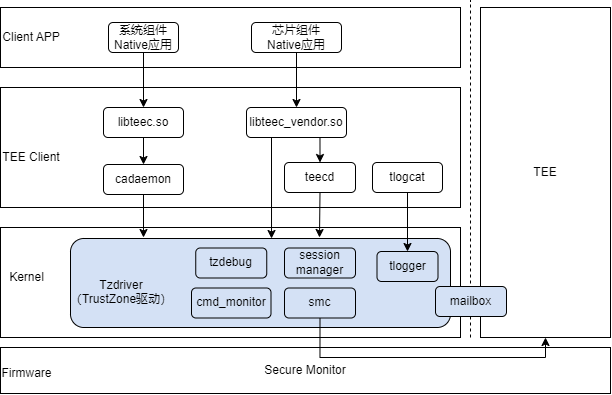

# Tzdriver驱动

## 简介

Tzdriver是部署在REE侧的内核驱动，支持REE和TEE之间通信。Tzdriver处理来自于Tee Client的命令，发送指令从REE切换到TEE。Tzdriver通过管理共享内存，支持REE和TEE之间共享数据。

Tzdriver驱动包含如下主要模块：

smc：发送smc指令，将CPU从REE侧切换到TEE侧运行。

session_manager：管理REE与TEE之间的通信会话。

mailbox：REE和TEE之间通过mailbox共享数据。

cmd_monitor：监控smc指令的运行，提供超时检测机制。

tzdebug：创建debugfs调试节点，方便开发人员调试TEE功能。

tlogger：TEE日志驱动模块，支持TEE日志记录和打印。

图1 Tzdriver驱动架构图



## 目录

```
/kernel/linux/common_modules/tzdriver
├── core
│   ├── cmdmonitor.c                # smc指令执行监控
    ├── gp_ops.c                    # GP TEE规范处理逻辑
    ├── mailbox_mempool.c           # REE和TEE共享内存管理
    ├── session_manager.c           # CA访问TA的session管理
    ├── smc_smp.c                   # 发送smc指令切换到TEE
    ├── tzdebug.c                   # 调试模块
├── tlogger                         # TEE日志驱动
```

## 配置选项

如果要使能Tzdriver驱动，需要修改linux内核代码仓中设备的defconfig文件，增加Tzdriver的配置选项：

```
#
# TEEOS
#
CONFIG_TZDRIVER=y
CONFIG_CPU_AFF_NR=1
CONFIG_KERNEL_CLIENT=y
CONFIG_TEELOG=y
CONFIG_PAGES_MEM=y
CONFIG_THIRDPARTY_COMPATIBLE=y
```

各选项其含义如下表所示：

**表 1** 配置选项说明

| 参数                         | 说明                                                         |
| ---------------------------- | ------------------------------------------------------------ |
| CONFIG_TZDRIVER              | Tzdriver模块开关。                                             |
| CONFIG_CPU_AFF_NR            | CA绑核功能，非零值代表限制仅cpuid小于CONFIG_CPU_AFF_NR的CPU可以进入TEE，0代表无限制，当前只支持在0核运行，所以值为1。 |
| CONFIG_KERNEL_CLIENT         | 支持内核CA选项。                                               |
| CONFIG_TEELOG                | TEE日志开关，建议开启。                                    |
| CONFIG_PAGES_MEM             | TEE日志内存管理，建议开启。                                |
| CONFIG_THIRDPARTY_COMPATIBLE | 兼容第三方opteed的适配，例如适配RK3568芯片需要开启此选项。     |

## 编译命令

Tzdriver驱动跟随kernel一起编译，以rk3568为例，可以单独编译boot_linux.img，编译命令如下

```
./build.sh --product-name rk3568 --ccache --build-target kernel --gn-args linux_kernel_version=\"linux-5.10\"
```

## 相关仓

[tee_client](https://gitee.com/openharmony/tee_tee_client)
