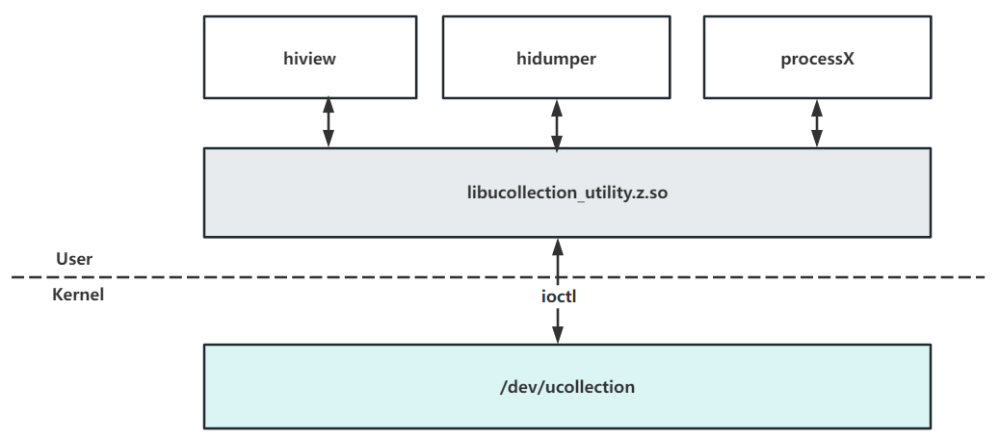

## 背景
当前系统需要获取进程的CPU维测数据，支持开发者性能问题分析，通过遍例所有进程的结点虽然可以获取所有进程的CPU使用率，但是该方法性能相对较差，为了提升获取效率，因此开僻了内核的设备结点，通过结点可能快速获取CPU的数据。

## ucollection(unified collection)模块
通过ioctl的方式向设备结点/dev/uncollection发送命令，内核根据不同的命令做不同的处理，返回相应的维测数据。


## 目录
统一采集设备的主要代码目录结构如下：

```
# 代码路径 /kernel/linux/common_modules/xpm
├── apply_ucollection.sh          # XPM 头文件
├── figures                       # ReadMe 内嵌图例
├── Konfig
├── Makefile
├── README_zh.md
├── ucollection_process_cpu.c     # 获取进程CPU数据
├── ucollection_process_cpu.h
├── unified_collection_data.h
├── unified_collection_driver.c   # 注册/dev/ucollection设备
```

## 相关仓

[内核子系统](https://gitee.com/openharmony/docs/blob/master/zh-cn/readme/%E5%86%85%E6%A0%B8%E5%AD%90%E7%B3%BB%E7%BB%9F.md)

[kernel_linux_5.10](https://gitee.com/openharmony/kernel_linux_5.10)

[kernel_linux_config](https://gitee.com/openharmony/kernel_linux_config)

[kernel_linux_build](https://gitee.com/openharmony/kernel_linux_build)
