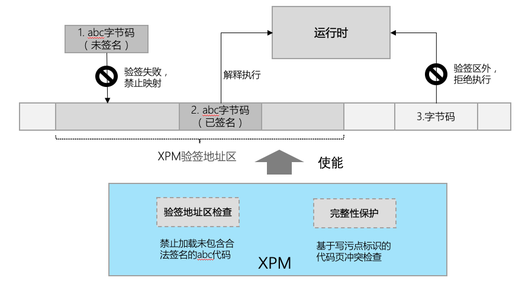
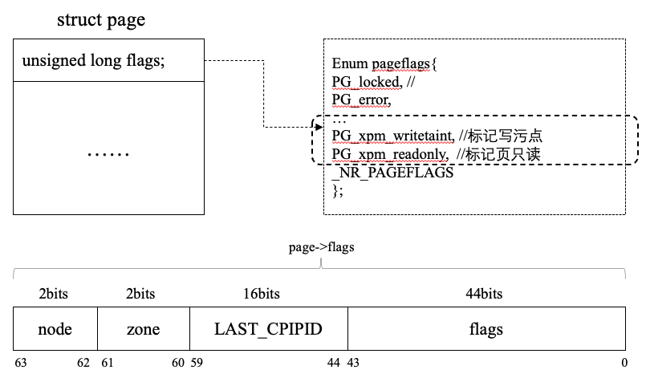

## 背景

当前许多应用滥用热更新机制以绕过应用市场审核，在端侧实现包括但不限于窃取用户数据、弹窗广告、静默安装应用、挖矿等恶意行为。这类恶意行为，极大降低了用户产品使用体验，并最终导致大量投诉，引发舆情公关危机。

为从源头上堵住恶意应用作恶途径，提高平台的核心竞争，OH有必要构建强制代码签名机制，具体措施包括：

1. 应用市场对通过安全审核的代码签名
2. 端侧强制验证代码签名，拒绝执行不合法的代码
3. 端侧提供代码完整性保护 ，防止代码内容在运行时被恶意篡改

## XPM（eXecutable Permission Manager）模块

XPM模块通过扩展内核能力，为应用的二进制和abc代码提供运行时的管控，强制仅包括合法签名的代码允许分配可执行权限（二进制）/通过方舟运行时检查（abc），相关代码才能被执行（abc代码为解释执行）。XPM主要通过三个功能实现上述能力，具体内容如下：

### 1.执行权限检查

通过hook特定系统调用函数，XPM在代码内存映射操作前，强制验证文件的代码签名合法性，拒绝将未包含合法签名的文件映射到可执行内存（见下图一）。此外，XPM还会通过解析文件头，获取文件的代码段信息，限制应用将通过签名验签的文件中数据内容映射到可执行内存。


### 2.XPM验签地址区

在HAP应用被拉起时，XPM会在进程的地址空间内保留一段验签地址范围，任何尝试被映射到该地址范围的文件都会被校验代码签名，无签名或签名不合法的文件映射操作将会失败（如下图二）。此外，运行时虚拟机在解释执行字节码时通过检查相应内容是否处于该验签地址区域判断代码是否合法。



### 3.代码完整性保护

为阻止应用在运行时通过映射代码到可写内存区，篡改已完成校验的代码内容，XPM基于写污点标记的代码执行权限冲突检查，为代码提供运行时的完整性保护。



新增两个页标识，只读代码页被标记为readonly，任何被映射到写内存区域的页都会被标记为writetainted，并且整个生命周期都不会被消除，直到该页被回收。当writetained的页被映射为只读代码（需标记为readonly），或者readonly的页被映射到可写区页（需标记为writetainted），将产生xpm标识冲突，此时将阻止页映射，禁止该访问发生。

## 目录

XPM执行权限管控的主要代码目录结构如下：

```
# 代码路径 /kernel/linux/common_modules/xpm
├── include                   # XPM 头文件
├── src
│   ├── core                  # XPM 管控代码
│   └── validator             # XPM 代码签名检查和代码解析模块
├── figures                   # ReadMe 内嵌图例
├── Konfig
├── Makefile
```

## XPM配置指导

1. XPM使能
   `CONFIG_SECURITY_XPM=y`

2. XPM禁用
   `CONFIG_SECURITY_XPM=n`

3. XPM调试信息
   `CONFIG_SECURITY_XPM_DEBUG=y`

## 管控规则说明

针对当前不同应用的运行需求，通过selinux对相应的应用做标签化处理（exec_no_sign & execmem_anon），实施不同的管控策略，具体如下：

1. 普通应用类：强制检查二进制可执行文件和abc字节码的合法代码签名，限制申请匿名可执行内存
2. webview类：强制二进制可执行文件和abc字节码的合法代码签名，不限制匿名可执行内存的申请，允许拥有JIT能力
3. 调测类：二进制可执行文件和abc字节码不包含合法代码签名，不限制匿名可执行内存的申请，允许拥有JIT能力
4. 沙箱类：不限制二进制可执行文件和abc字节码包含合法代码签名，不限制匿名可执行内存的申请，允许拥有JIT能力

## 相关仓

[内核子系统](https://gitee.com/openharmony/docs/blob/master/zh-cn/readme/%E5%86%85%E6%A0%B8%E5%AD%90%E7%B3%BB%E7%BB%9F.md)

[kernel_linux_5.10](https://gitee.com/openharmony/kernel_linux_5.10)

[kernel_linux_config](https://gitee.com/openharmony/kernel_linux_config)

[kernel_linux_build](https://gitee.com/openharmony/kernel_linux_build)
